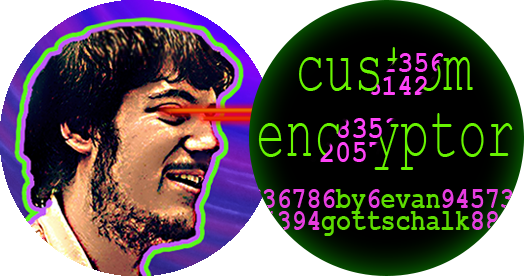

<!-- PROJECT SHIELDS -->
<!--
*** I'm using markdown "reference style" links for readability.
*** Reference links are enclosed in brackets [ ] instead of parentheses ( ).
*** See the bottom of this document for the declaration of the reference variables
*** for contributors-url, forks-url, etc. This is an optional, concise syntax you may use.
*** https://www.markdownguide.org/basic-syntax/#reference-style-links
-->
[![Contributors][contributors-shield]](https://github.com/EvanGottschalk/graphs/contributors)
[![Forks][forks-shield]](https://github.com/EvanGottschalk/CustomEncryptor/network/members)
[![Stargazers][stars-shield]](https://github.com/EvanGottschalk/CustomEncryptor/stargazers)
[![Issues][issues-shield]](https://github.com/EvanGottschalk/CustomEncryptor/issues)
[![MIT License][license-shield]](https://github.com/EvanGottschalk/CustomEncryptor/blob/main/LICENSE)
[![LinkedIn][linkedin-shield]](https://www.linkedin.com/in/evan-gottschalk/)


<!-- PROJECT LOGO -->
<br />
<p align="center">
  <a href="https://github.com/EvanGottschalk/CustomEncryptor">
    
  </a>

  <h3 align="center">CustomEncryptor</h3>

  <p align="center">
    A simple, customizable program for encrypting and decrypting data
    <br />
    <a href="https://github.com/EvanGottschalk/CustomEncryptor"><strong>Explore the docs »</strong></a>
    <br />
    <br />
    <a href="https://github.com/EvanGottschalk/CustomEncryptor/issues">Report Bug</a>
    ·
    <a href="https://github.com/EvanGottschalk/CustomEncryptor/issues">Request Feature</a>
  </p>
</p>

<!-- ABOUT THE PROJECT -->
## About The Project

`CustomEncryptor` is a cryptography program used to encrypt data by converting it to seemingly random numbers. This is done via a custom cipher: users get to choose the way each character is mapped, thus guaranteeing a unique means of encryption and decryption. Alternatively, `CustomEncryptor` can also be used to generate a cipher on its own using random numbers, which saves users the effort of assigning characters one at a time.

The cipher can be broken up into multiple files, which increases its efficacy. By using `FetchEncryptedFiles.py`, users can save parts of their cipher in an encrypted zip folder and access them when needed. This is particularly useful when paired with removable storage. By saving a portion of one's cipher in an encrypted zip folder on a flash drive or other removable device, one can essentially use that removable device as a hardware key.


### Prerequisites

The `random` library is used in `CustomEncryptor.py` to encrypt data, and to create new ciphers. It is a default library of Python, so it should only need to be imported.

```sh
import random
```

The `pickle` library is used in `CustomEncryptor.py` and `FetchEncryptedFiles.py` to access and create files. It is a default library of Python, so it should only need to be imported.

```sh
import pickle
```

The `zipfile` library is used in `FetchEncryptedFiles.py` to access encrypted zip folders. If you are not using an encrypted zip folder, particularly one on removable storage, then this library is not necessary. It is a default library of Python, so it should only need to be imported.

```sh
import zipfile
```


### Installation

1. Download the program files
2. Use the program to create a cipher using `generateCipher()`
3. Divide the cipher into multiple files*
4. Save the portions of the cipher in multiple locations, and record the locations in a file*
5. Congratulations! You can now use `encrypt()` to encrypt data and `decrypt()` to decrypt it later!

\**Steps 3 and 4 require manual file management. These features will be modified to be more automated and user-friendly.*


<!-- USAGE EXAMPLES - to be filled out after further testing-->
<!--
## Usage

Use this space to show useful examples of how a project can be used. Additional screenshots, code examples and demos work well in this space. You may also link to more resources.
-->


<!-- ROADMAP -->
## Roadmap

See the [open issues](https://github.com/EvanGottschalk/CustomEncryptor/issues) for a list of proposed features (and known issues).


<!-- CONTRIBUTING -->
## Contributing

All feedback is extremely welcome! Getting this program to be as secure and simple as possible is my goal. Please let me know if you see any improvements I can make, or any holes or backdoors that need to be sealed.

Honestly, I was hesitant about publicizing a program I intend to use for my own security purposes. However, I trust that any feedback I get will strengthen `CustomEncryptor` by a much greater amount than sharing the code compromises it.


<!-- LICENSE -->
## License

Distributed under the MIT License. See `LICENSE` for more information.


<!-- CONTACT -->
## Contact

Evan Gottschalk - [Evan on LinkedIn](https://www.linkedin.com/in/evan-gottschalk/) - [@Fort1Evan](https://twitter.com/Fort1Evan) - magnus5557@gmail.com

Project Link: [https://github.com/EvanGottschalk/CustomEncryptor](https://github.com/EvanGottschalk/CustomEncryptor)


<!-- ACKNOWLEDGEMENTS -->
<!-- To be filled out later - I may use some code that a friend of mine provided
## Acknowledgements

* []()
* []()
* []()
-->


<!-- MARKDOWN LINKS & IMAGES -->
<!-- https://www.markdownguide.org/basic-syntax/#reference-style-links -->
[contributors-shield]: https://img.shields.io/github/contributors/EvanGottschalk/repo.svg?style=for-the-badge
[contributors-url]: https://github.com/EvanGottschalk/CustomEncryptor/graphs/contributors
[forks-shield]: https://img.shields.io/github/forks/EvanGottschalk/repo.svg?style=for-the-badge
[forks-url]: https://github.com/EvanGottschalk/CustomEncryptor/network/members
[stars-shield]: https://img.shields.io/github/stars/EvanGottschalk/repo.svg?style=for-the-badge
[stars-url]: https://github.com/EvanGottschalk/CustomEncryptor/stargazers
[issues-shield]: https://img.shields.io/github/issues/EvanGottschalk/repo.svg?style=for-the-badge
[issues-url]: https://github.com/EvanGottschalk/CustomEncryptor/issues
[license-shield]: https://img.shields.io/github/license/EvanGottschalk/repo.svg?style=for-the-badge
[license-url]: https://github.com/EvanGottschalk/CustomEncryptor/blob/master/LICENSE.txt
[linkedin-shield]: https://img.shields.io/badge/-LinkedIn-black.svg?style=for-the-badge&logo=linkedin&colorB=555
[linkedin-url]: https://linkedin.com/in/EvanGottschalk
